<p align="center">
  
</p>

<p align="center">
  <a href="https://github.com/ishandutta2007/Awesome-Awesome-Awesome"></a><a href="https://discord.gg/jc4xtF58Ve"></a>
  <a href="https://github.com/ishandutta2007/Awesome-AI-Enterprise-Search/stargazers"></a>
  <a href="https://github.com/ishandutta2007/Awesome-AI-Enterprise-Search/network/members"></a>
  <a href="https://github.com/ishandutta2007/Awesome-AI-Enterprise-Search/blob/main/LICENSE"></a>
  <a href="https://github.com/ishandutta2007"></a>
</p>

---

# 🔍 Awesome AI Enterprise Search & RAG Ecosystem 🚀

> **A Curated List of SaaS Platforms & Open-Source Projects for AI Enterprise Search, Retrieval-Augmented Generation (RAG), Permission-Aware Knowledge Discovery, and Workplace Search Engines.**

Welcome to the definitive, SEO-optimized directory of **AI Enterprise Search** and **Workplace Retrieval Platforms**. These solutions index enterprise applications (Slack, Google Drive, Confluence, Microsoft 365, Notion, Jira, Salesforce, GitHub), respect enterprise Access Control Lists (ACLs), and deliver accurate, generative answers grounded in private corporate knowledge.

---

## 📑 Table of Contents

- [📊 Market Overview & Industry Dynamics](#-market-overview--industry-dynamics)
- [🏢 Commercial SaaS & Hosted Platforms](#-commercial-saas--hosted-platforms)
- [💻 Open-Source GitHub Projects](#-open-source-github-projects)
- [🏗️ Architectural Blueprint: Enterprise AI Search](#️-architectural-blueprint-enterprise-ai-search)
- [🤝 How to Contribute](#-how-to-contribute)
- [⚠️ Disclaimer & Security Guidelines](#️-disclaimer--security-guidelines)
- [📈 Star History](#-star-history)
- [💖 Support & Community](#-support--community)

---

## 📊 Market Overview & Industry Dynamics

> 💡 **Market Insights**: The Global Enterprise Search & AI Knowledge Discovery market is valued at **~$4.8 Billion (2024)** and is projected to reach **$18.5 Billion+ by 2032** (CAGR ~18.5%). The market is currently **moderately fragmented**—rapidly shifting from legacy keyword search engines to AI-native RAG platforms (such as Glean and Perplexity Enterprise) alongside hyperscaler productivity suites (Microsoft 365 Copilot).

---

## 🏢 Commercial SaaS & Hosted Platforms

Below is a curated table of enterprise-grade commercial AI search solutions, **sorted by Company Size / Valuation (descending)**.

| Platform / Product 🏢 | Description 📝 | Starting Price 💵 | Free Tier / Trial Limit 🎁 | Company Size & Valuation 📊 |
| :--- | :--- | :--- | :--- | :--- |
| **[Microsoft Copilot Search](https://www.microsoft.com/microsoft-365/copilot)** | Enterprise AI search & conversational assistant across Teams, SharePoint, and Office 365. | `$30/user/month` *(annual commitment)* | `30-day free trial` *(via M365 Enterprise trial)* | **~$3.1 Trillion** *(Market Cap)* |
| **[IBM watsonx Discovery](https://www.ibm.com/products/watson-discovery)** | Enterprise content mining and NLP search over complex structured & unstructured documents. | `$500/month` *(Plus plan base)* | `30-day free trial` *(IBM Cloud Lite, 10k doc chunks)* | **~$200 Billion** *(Market Cap)* |
| **[Perplexity Enterprise](https://www.perplexity.ai/enterprise)** | AI research engine with permission-aware file search, web grounding, and deep discovery. | `$40/seat/month` *(Enterprise Pro)* | `30-day pilot trial` *(up to 250 seats for orgs)* | **~$20 Billion** *(Valuation)* |
| **[Elastic AI Assistant](https://www.elastic.co/enterprise-search)** | Search engine & vector platform with hybrid retrieval across enterprise logs and internal documents. | `$95/month` *(Elastic Cloud Standard)* | `14-day free trial` *(no credit card required)* | **~$8.5 Billion** *(Market Cap)* |
| **[Glean](https://www.glean.com/)** | Turnkey workplace AI search indexing 40+ apps with strict permission enforcement & generative answers. | `$45/user/month` *(min 100 seats)* | `30-day sandbox demo` *(paid proof-of-concept available)* | **~$7.2 Billion** *(Valuation)* |
| **[Hebbia](https://www.hebbia.com/)** | AI agent search platform (Matrix) designed for complex financial, legal, and unstructured doc analysis. | `$100/user/month` *(Team plan min 5 seats)* | `14-day interactive trial` *(matrix demo)* | **~$700 Million** *(Valuation)* |
| **[Coveo Relevance Cloud](https://www.coveo.com/)** | AI search, recommendation, and relevance engine for enterprise portals, Salesforce, and intranet. | `$1,500/month` *(Pro Cloud tier)* | `30-day free trial` *(Salesforce / Commerce sandbox)* | **~$600 Million** *(Market Cap)* |
| **[Guru AI Search](https://www.getguru.com/)** | Enterprise wiki & AI search browser extension delivering verified answers across corporate apps. | `$15/user/month` *(All-in-One plan)* | `Free forever plan` *(up to 3 users)* | **~$300 Million** *(Valuation)* |
| **[Lucidworks Fusion](https://lucidworks.com/)** | Enterprise search framework leveraging hybrid search, signal processing, and enterprise RAG. | `$2,000/month` *(Cloud node deployment)* | `14-day sandbox trial` *(evaluation cluster)* | **~$300 Million** *(Valuation)* |
| **[Sinequa](https://www.sinequa.com/)** | Neural search engine connecting vast unstructured enterprise data silos with deep security ACLs. | `$3,000/month` *(Enterprise node tier)* | `30-day enterprise evaluation trial` | **~$200 Million** *(Valuation)* |

---

## 💻 Open-Source GitHub Projects

Explore the top open-source projects for building self-hosted, custom enterprise search and RAG pipelines, **sorted by GitHub_Stars_Count (descending)**.

| Repo / Project 💻 | Stars ⭐️ | Description 📝 | Key Highlights ⚡️ |
| :--- | :--- | :--- | :--- |
| **[LangChain](https://github.com/langchain-ai/langchain)** | <a href="https://github.com/langchain-ai/langchain/stargazers"></a> | Standard framework for building LLM-powered enterprise search pipelines, agents, and RAG chains. | Python/TS, multi-vector retrieval, agentic workflows |
| **[RAGFlow](https://github.com/infiniflow/ragflow)** | <a href="https://github.com/infiniflow/ragflow/stargazers"></a> | Open-source RAG engine based on deep document understanding for complex enterprise documents. | Layout parsing, hybrid search, citations |
| **[Elasticsearch](https://github.com/elastic/elasticsearch)** | <a href="https://github.com/elastic/elasticsearch/stargazers"></a> | Industry-standard distributed search engine supporting BM25 full-text, vector HNSW, and hybrid search. | Battle-tested, scalable, enterprise ACLs |
| **[AnythingLLM](https://github.com/Mintplex-Labs/anything-llm)** | <a href="https://github.com/Mintplex-Labs/anything-llm/stargazers"></a> | All-in-one desktop and self-hosted app to chat with enterprise documents and workspace knowledge bases. | Single-user & multi-user Docker, local LLMs |
| **[Meilisearch](https://github.com/meilisearch/meilisearch)** | <a href="https://github.com/meilisearch/meilisearch/stargazers"></a> | Ultra-fast open-source search engine providing instant search experience and vector hybrid search. | Sub-50ms response, developer-friendly API |
| **[LlamaIndex](https://github.com/run-llama/llama_index)** | <a href="https://github.com/run-llama/llama_index/stargazers"></a> | Data framework connecting enterprise data sources (SQL, APIs, PDFs) to LLMs for retrieval. | Advanced indexing, sub-question query engines |
| **[Milvus](https://github.com/milvus-io/milvus)** | <a href="https://github.com/milvus-io/milvus/stargazers"></a> | Cloud-native open-source vector database built for billion-scale enterprise vector search. | Distributed, GPU acceleration, hybrid search |
| **[LightRAG](https://github.com/HKUDS/LightRAG)** | <a href="https://github.com/HKUDS/LightRAG/stargazers"></a> | Fast Retrieval-Augmented Generation engine using dual-level knowledge graph structures. | Graph + vector retrieval, low latency |
| **[Khoj](https://github.com/khoj-ai/khoj)** | <a href="https://github.com/khoj-ai/khoj/stargazers"></a> | Open-source AI second brain to search & chat over local documents, Notion, GitHub, and web. | Desktop, Emacs, Obsidian, self-hostable |
| **[Qdrant](https://github.com/qdrant/qdrant)** | <a href="https://github.com/qdrant/qdrant/stargazers"></a> | Production-grade vector similarity search engine with rich filtering payload support. | Written in Rust, memory efficient, cloud-ready |
| **[Onyx](https://github.com/onyx-dot-app/onyx)** *(formerly Danswer)* | <a href="https://github.com/onyx-dot-app/onyx/stargazers"></a> | Top open-source (MIT) Glean alternative with 40+ connectors and permission-aware AI chat. | ACL sync, Slack/Drive/Confluence connectors |
| **[Chroma](https://github.com/chroma-core/chroma)** | <a href="https://github.com/chroma-core/chroma/stargazers"></a> | AI-native open-source embedding database for building local enterprise search applications. | Lightweight, Python/JS SDKs, simple setup |
| **[Typesense](https://github.com/typesense/typesense)** | <a href="https://github.com/typesense/typesense/stargazers"></a> | Fast, typo-tolerant open-source search engine optimized for enterprise application search. | Algolia alternative, C++ core, vector support |
| **[Haystack](https://github.com/deepset-ai/haystack)** | <a href="https://github.com/deepset-ai/haystack/stargazers"></a> | Modular Python framework by Deepset for building production-ready RAG & enterprise search. | Pipeline builders, flexible retriever components |
| **[Weaviate](https://github.com/weaviate/weaviate)** | <a href="https://github.com/weaviate/weaviate/stargazers"></a> | Open-source vector search engine supporting hybrid vector and scalar filtering out of the box. | GraphQL/REST APIs, multi-modal vector search |
| **[OpenSearch](https://github.com/opensearch-project/OpenSearch)** | <a href="https://github.com/opensearch-project/OpenSearch/stargazers"></a> | Community-driven distributed search & analytics suite with neural vector search capabilities. | Apache 2.0, AWS supported, high throughput |
| **[Verba](https://github.com/weaviate/Verba)** | <a href="https://github.com/weaviate/Verba/stargazers"></a> | Open-source modular RAG application designed for enterprise document search & chat. | Powered by Weaviate, custom chunkers |
| **[Vespa](https://github.com/vespa-engine/vespa)** | <a href="https://github.com/vespa-engine/vespa/stargazers"></a> | Open-source engine for vector search and real-time enterprise AI retrieval at massive scale. | Used by Yahoo, handles heavy real-time traffic |
| **[Fess](https://github.com/codelibs/fess)** | <a href="https://github.com/codelibs/fess/stargazers"></a> | Open-source enterprise search server with web/file crawler and OpenSearch integration. | Java, built-in crawler, admin UI |

---

## 🏗️ Architectural Blueprint: Enterprise AI Search

```
                                  [ Enterprise Apps ]
                     (Slack, Google Drive, Confluence, Jira, Notion, S3)
                                          │
                                          ▼
                             [ Connectors & ACL Sync ]
                     (Permission-Aware Ingestion & Delta Indexing)
                                          │
                                          ▼
                             [ Chunking & Embedding ]
                    (Semantic Chunking + Hybrid Vector Models)
                                          │
                                          ▼
                           [ Vector + Keyword Index ]
                      (Elasticsearch / OpenSearch / Onyx / Qdrant)
                                          │
                                          ▼
                              [ User Query & RERANK ]
                     (Hybrid BM25 + Vector Similarity + Cohere Rerank)
                                          │
                                          ▼
                            [ LLM Generative Answer ]
                   (Grounded Answer + Citations + Security Filter)
```

---

## 🤝 How to Contribute

We welcome community contributions! To add a new platform or update existing entries:

1. 🍴 **Fork** this repository.
2. 📝 Add or edit entries in `README.md` following the Markdown table format.
3. 🔎 Ensure all pricing, trial limits, and valuation metrics are factually backed.
4. 🚀 Submit a **Pull Request (PR)** with a clear summary.

Awesome lists standards reference: [Awesome Lists Repository](https://github.com/ishandutta2007/Awesome-Awesome-Awesome).

---

## ⚠️ Disclaimer & Security Guidelines

- **Security & Privacy**: Enterprise search platforms index sensitive internal corporate data. Ensure strict enforcement of source permissions, OAuth SSO, encryption-at-rest, and security access audits.
- **Deployment Choice**: Open-source stacks offer complete data residency and control but require self-hosted infrastructure. Commercial SaaS offerings provide turn-key connectors and managed compliance.

---

## 📈 Star History

[](https://star-history.dera.page/#ishandutta2007/Awesome-AI-Enterprise-Search&type=date&legend=top-left)

---

## 💖 Support & Community

Thank you for exploring **Awesome AI Enterprise Search**! If you find this curated list valuable for your team, research, or enterprise stack evaluation:

- ⭐️ **Star** this repository to help others discover it.
- 🔀 **Fork** and contribute new tools or updates.
- 📢 **Share** with knowledge managers, platform engineers, and AI builders.
- ☕️ **Sponsor & Support**: Support the project via [GitHub Sponsors](https://github.com/sponsors/ishandutta2007).

---

<p align="center">
  <b>Built with ❤️ for AI Engineers, Knowledge Managers, and Enterprise Platform Leaders.</b>
</p>
